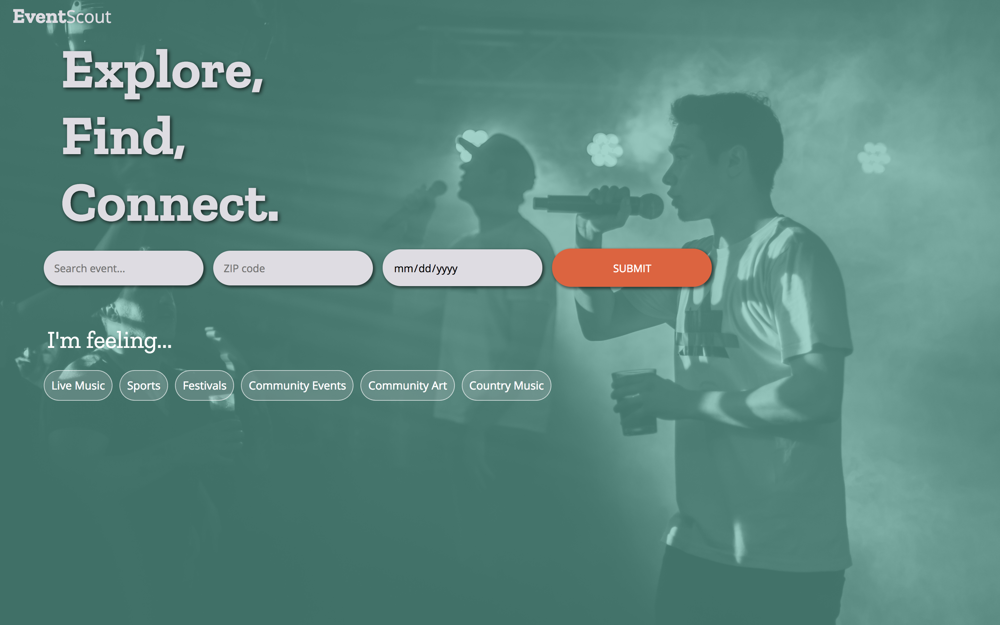
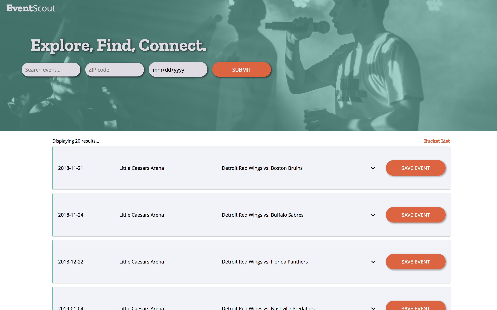
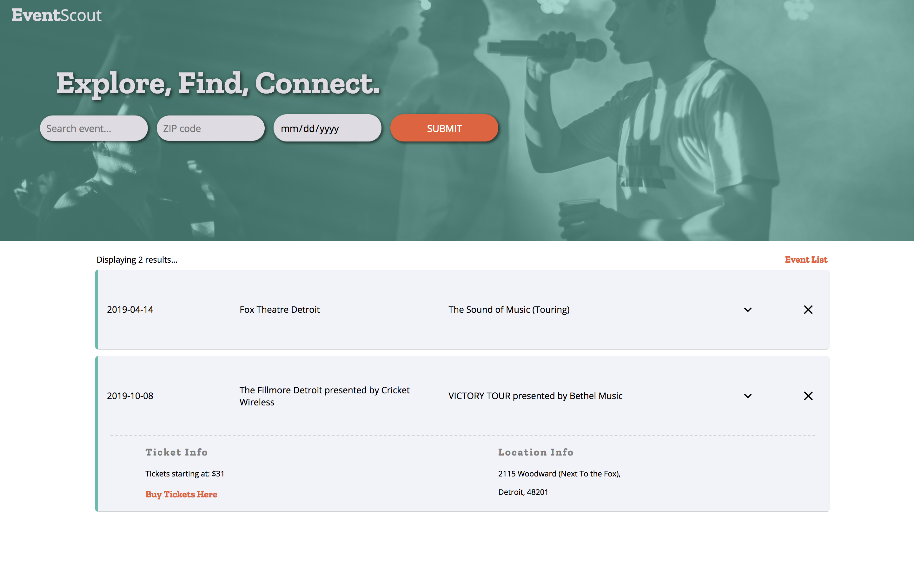

# event-scout-event-website
Group project. Create an event application using TicketMaster API and Angular

Task: Use Ticketmaster API to build an Angular app for searching and saving events.

API: https://developer.ticketmaster.com/products-and-docs/apis/getting-started/

Build Specifications
1. Allow users to filter events based on at least three criteria (e.g.,: keyword, location, date
range).
2. Display events that match the user’s selected criteria.
3. Allow users to select individual events to see more details on your site.
4. Allow users to click a link to see the event on the Ticketmaster site.
5. Allow users to mark events from the results for a bucket list.
6. Include a separate route where users can
   a. See a list of events they’ve marked for the bucket list
   b. Select individual events to see more details
   c. Remove events from the bucket list
7. Do not implement log in. Built as if a user is already logged in.
8. Use at least three components:
   a. searchCriteria the criteria selection
   b. eventList for the list of results
   c. bucketlistPage for the favorites list route

